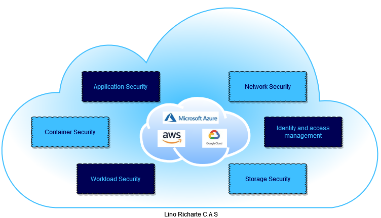

# CAS
Cloud Application Security

## Table of Contents
- [What is cloud application security](#what-is-cloud-application-security)
- [Who exactly owns cloud security](#Who-exactly-owns-cloud-security)
- [Top cloud application security issues](#Top-cloud-application-security-issues)
- [Cloud application best practices for implementing effective security measures](#Cloud-application-best-practices-for-implementing-effective-security-measures)
    * [Identity access management](#Identity-access-management)
    * [Data privacy & compliance](#Data-privacy-&-compliance)
    * [Threat monitoring](#Threat-monitoring)
    * [Encryption](#Encryption)
    * [Automated security testing](#Automated-security-testing)

### What is cloud application security
Cloud application security is a series of defined policies, processes, controls, and technology governing all information that protect software deployed in the cloud. Protecting cloud-based applications with network and infrastructure security is no longer enough, and most organizations leverage application-level security measures as well.

Cloud application security measures are usually implemented during software development and after applications are deployed. This comprehensive approach is the best way to prevent security incidents from negatively impacting the organization’s reputation and revenue.

### Who exactly owns cloud security
As cloud native application development grows in popularity, it’s becoming more important for security, development, and operations teams to share responsibility for cloud application security.

The SaaS vendor is responsible for securing the application’s infrastructure, as well as its APIs. This means that they are responsible for the security of the servers, networks, and code that makes the application a product for customers.

This evolving approach to application security, where developers are taking on additional AppSec responsibility, is called DevSecOps.
Even with DevSecOps adoption growing, ownership over cloud application security is likely to evolve over the coming years.

### Top cloud application security issues
It is no secret that there are security issues in cloud computing that IT professionals must be aware of. Cloud application security issues are cyber threats that a cloud-based application is exposed to. 

These threats can include:
- Unauthorized access to application functionality or data
- Distributed denial of service (DDos) attacks related to poorly managed resources
- Data leakage from insecure APIs or other infrastructure endpoints
- Exposed application services due to misconfigurations
- Hijacking of user accounts because of poor encryption and identity management

### Cloud application best practices for implementing effective security measures
#### Identity access management
Application security doesn’t exist in a silo, so it’s important to integrate secure measures like identity access management (IAM) with broader enterprise security processes. IAM ensures every user is authenticated and can only access authorized data and application functionality. A holistic approach to IAM can protect cloud applications and improve the overall security posture of an organization.

#### Data privacy & compliance
Along with application security, data privacy, and compliance are crucial for protecting end-users of cloud native applications. For example, compliance with GDPR requires careful vetting of open source components, which are frequently used to speed up cloud native application development. In addition, data encryption, access controls, and other cloud security controls can also help protect the privacy of application users.

#### Threat monitoring
After applications are deployed to the cloud, it’s crucial to continuously monitor for cyber threats in real-time. Since the application security threat landscape is constantly evolving, leveraging threat intelligence data is crucial for staying ahead of malicious actors. This enables development teams to find and remediate cloud application security threats before they impact end-users.

#### Encryption
Implementing encryption in the right areas optimizes application performance while protecting sensitive data. In general, the three types of data encryption to consider are encryption in transit, encryption at rest, and encryption in use.

- Encryption in transit protects data as it’s transmitted between cloud systems or to end-users. This includes encrypting communication between two services, whether they’re internal or external, so that data cannot be intercepted by unauthorized third parties.
- Encryption at rest ensures data cannot be read by unauthorized users while it is stored in the cloud. This can include multiple layers of encryption at the hardware, file, and database levels to fully protect sensitive application data from data breaches.
- Encryption in use is aimed at protecting data that is currently being processed, which is often the most vulnerable data state. Keeping data in use safe involves limiting access beforehand using IAM, role based access control, digital rights protection etc.

#### Automated security testing
A key part of DevSecOps is integrating automated security testing directly into the development process. By automatically scanning for vulnerabilities throughout the continuous integration and continuous delivery (CI/CD) process, development teams can ensure every new software build is secure before deploying to the cloud. This includes not only the code and open source libraries that applications rely on, but the container images and infrastructure configurations they’re using for cloud deployments.

Implementing developer-friendly security scanning tooling with existing developer workflows can enable the “shifting left” of cloud application security. Shifting left testing can dramatically reduce the cost of vulnerability detection and remediation, while also ensuring developers can continue pushing code quickly. 
